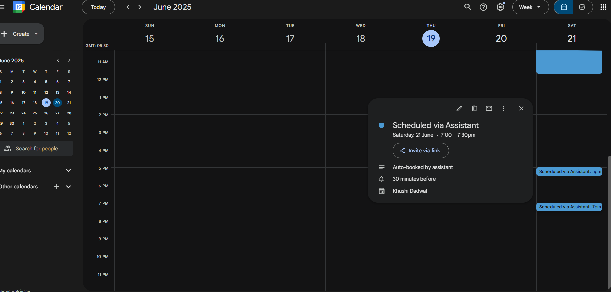

# 🤖 The Smart Scheduler AI Agent

An intelligent, voice-enabled assistant that helps you schedule and manage your calendar using Google Calendar and the Gemini API. It understands natural language, checks your availability, and books meetings, all through simple conversations.

## -  Features

- **Voice-enabled :** Natural speech input/output
- **Gemini LLM :** Extracts intent, duration, preferences, and more
- **Google Calendar Integration :** Creates and checks events in real-time
- **Smart Slot Finding :** Ranks time slots based on availability, buffer gaps, and time of day
- **Multi-turn Conversation :** Tracks state across multiple turns
- **Conflict Resolution :** Handles fully booked days with alternative suggestions

---
## - How It Works

### 📥 User Input
- Captures audio using speech recognition
- Transcribes it to text and passes to Gemini LLM

### 🧠 Gemini LLM Processing
- Prompt extracts:
  - `duration_minutes`
  - `preferred_date`
  - `time_range`
  - `urgency`, `flexibility`, `meeting_type`
- If any of these are missing, the bot asks clarifying questions

### 🧩 Orchestration Logic
- Maintains context using a `ConversationState` machine
- Stores user preferences in `MeetingRequest`
- Checks availability using `AdvancedCalendarManager`
- Suggests ranked slots with confidence scores
- Handles ambiguous input (e.g., “after my last meeting”, “sometime next week”)

### 📅 Google Calendar Integration
- Uses OAuth2 + Calendar API
- Fetches events for a date range
- Books new meetings after slot confirmation

### 🎤 Voice Output
- Uses `pyttsx3` for speaking responses

---

## - Tech Stack

- Python
- Google Calendar API
- Gemini 1.5 Flash (via Google GenerativeAI SDK)
- SpeechRecognition + PyAudio
- pyttsx3 (offline TTS)
- dotenv (for secret management)

---

## - Setup Instructions

### 1. Clone the Repository
```bash
git clone https://github.com/khushidadwal/The-Smart-Scheduler-AI-Agent.git
cd The-Smart-Scheduler-AI-Agent
```

### 2. Create and Activate Virtual Environment
```bash
python -m venv venv
source venv/bin/activate      # macOS/Linux
venv\Scripts\activate         # Windows
```

### 3. Install Dependencies
```bash
pip install -r requirements.txt
```

### 4. Add `.env` File
Create a `.env` file in the root directory:
```env
GEMINI_API_KEY=your_gemini_api_key
GOOGLE_CALENDAR_CREDENTIALS_PATH=credentials.json
DEFAULT_TIMEZONE=Asia/Kolkata
TTS_RATE=200
TTS_VOLUME=0.9
```

> Don't commit `.env` or `credentials.json` to GitHub.

### 5. Google API Setup
- Enable Google Calendar API from Google Cloud Console
- Download `credentials.json` from OAuth client setup
- Place it in your root directory

### 6. Run the Assistant
```bash
python main.py
```

---

## ✅ Example Interaction

```
👤: I want to schedule a meeting.
🤖: Okay! How long should the meeting be?
👤: 1 hour
🤖: Got it. Do you have a preferred day or time?
👤: Sometime Tuesday afternoon
🤖: I found these options: 2:00 PM or 4:30 PM. Which one?
👤: Option 1
🤖: ✅ Great! Your meeting has been scheduled at 2:00 PM on Tuesday.

```

## - Security Best Practices

- `credentials.json`, `.env`, and `token.json` must NOT be committed
- Store API keys in environment variables
- Add `token.json` to `.gitignore`

---

## - Demo Video

Click on the image below for demo video.

<a href="https://drive.google.com/file/d/1v_BeFpNsRF8bTIHFjA6r5MAJDFPufT2C/view?usp=sharing" target="_blank">
  
</a>


Link : https://drive.google.com/file/d/1v_BeFpNsRF8bTIHFjA6r5MAJDFPufT2C/view?usp=sharing

---

